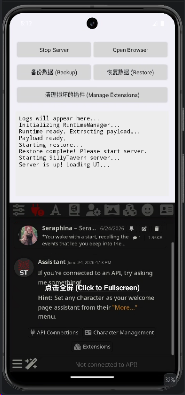
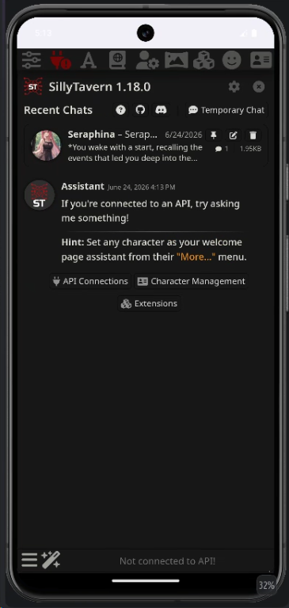

# stAPK Mobile

> 一键安装 SillyTavern，无需命令行 —— 在手机上运行你的 AI 角色扮演服务端。

stAPK Mobile 是一个完全原生的 Android 客户端，将 [SillyTavern](https://github.com/SillyTavern/SillyTavern)（AI 角色扮演前端）和底层的 Node.js 运行环境打包进一个 APK 中。安装后直接使用图形化控制面板操作，无需任何命令行基础，告别 Termux 依赖。

## 功能

- **一键启动** — 图形化面板启动 SillyTavern，直观展示实时运行日志。
- **内置原生环境** — 抛弃 Termux 依赖，使用内置私有 Node.js 与 Payload，避免环境污染。
- **后台保活服务** — 支持在手机自带浏览器中打开，同时自动开启前台服务 (Foreground Service) 并持有唤醒锁 (WakeLock)，有效防止服务被杀。
- **一键备份/恢复** — 基于 Android SAF (存储访问框架)，一键将角色卡、聊天等数据导出为 `.zip` 或从外部导入。
- **纯净更新** — 后续发版更新直接覆盖安装 APK 即可，无需手动 git pull。

## 截图





## 工作原理

```text
┌──────────────────────────────────────┐
│           stAPK Mobile               │
│  ┌────────────────────────────────┐  │
│  │   Android UI (Kotlin)           │  │
│  │   MainActivity / WebView       │  │
│  │   ┌──────┐ ┌──────┐ └──────┘  │  │
│  │   └──────┘ └──────┘ └──────┘  │  │
│  └──────────────┬─────────────────┘  │
│                 │ 调用 JNI / Process │
│  ┌──────────────▼─────────────────┐  │
│  │   RuntimeManager               │  │
│  │   解压 Payload.tgz              │  │
│  │   ┌────────────────────────┐   │  │
│  │   │  libnode.so             │   │  │
│  │   │  执行 server.js         │   │  │
│  │   │  → localhost:8000       │   │  │
│  │   └────────────────────────┘   │  │
│  └────────────────────────────────┘  │
└──────────────────────────────────────┘
```

1. 用户初次启动，`RuntimeManager` 自动解压内置的 `payload.tgz`。**注意：只有日志显示 `Payload ready` 后，才可以启动服务。**
2. 点击启动后，通过私有目录下的 Node.js 二进制文件直接拉起 `server.js`。
3. `KeepAliveService` 负责在切出应用（如点击 Open Browser）时维持 CPU 唤醒，防止断连。

## 下载

前往 [Releases](../../releases) 页面下载最新 APK。

| 要求 | 说明 |
|------|------|
| Android 版本 | 7.0+ (API 24+) |
| 架构 | arm64-v8a |
| 存储空间 | ~1.0GB（解压后体积） |

## 构建

```bash
# 1. 克隆代码
git clone https://github.com/zaixiakongyiji/stapk-termux.git

# 2. 拉取 LFS 大文件 (Node.js 运行时与 Payload)
git lfs pull

# 3. 构建 APK
cd mobile
./gradlew assembleDebug

# 4. APK 位于
# mobile/app/build/outputs/apk/debug/
```

> 详细构建指南见 [AGENTS.md](AGENTS.md)

## 自动发版

仓库根目录已经提供 GitHub Actions 工作流：

- `CI`：提交到 `master` 或提交 PR 时自动跑关键单测和 Debug 构建
- `Release`：推送 `v*` tag 时自动构建 `arm64-v8a release APK` 并上传到 GitHub Release

标准发版方式：

```bash
git push origin master
git tag v0.1.1
git push origin v0.1.1
```

详细说明见 [GitHub 自动构建与发版](docs/reference/github-release-automation.md)。

## 目录结构

```
stapk-termux/
├── mobile/                 # 原生 Android 客户端源码
│   └── app/src/main/
│       ├── assets/         # 存放 payload.tgz 和 runtime-android-arm64-node24.zip (LFS)
│       ├── java/           # Kotlin 核心代码 (RuntimeManager 等)
│       └── res/            # UI 布局
├── .github/workflows/      # CI/CD 自动化构建脚本
└── docs/                   # 设计文档与规范
```

## 许可证

本应用为 [SillyTavern](https://github.com/SillyTavern/SillyTavern) 的非官方 Android 打包外壳。内置的 SillyTavern 遵循其原始许可证 ([AGPL-3.0](https://www.gnu.org/licenses/agpl-3.0.html))。外壳相关自定义代码保留在本仓库。

## 致谢

- [SillyTavern](https://sillytavern.app) — AI 角色扮演前端
- [Node.js](https://nodejs.org/) — 运行时环境

---

**stAPK Mobile** — 让 SillyTavern 在手机上开箱即用。
