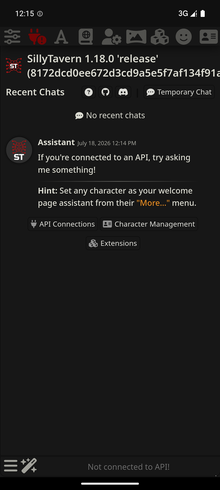
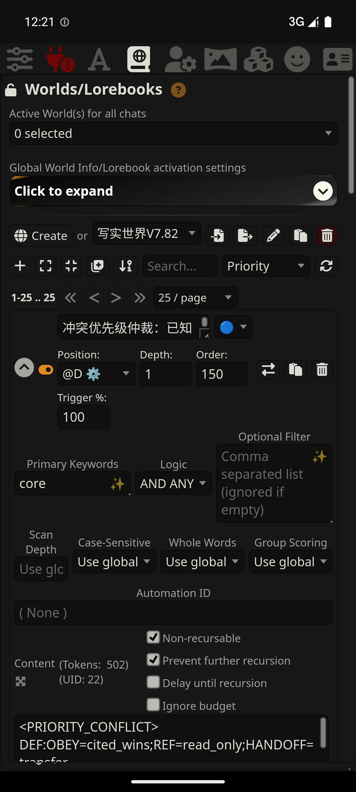
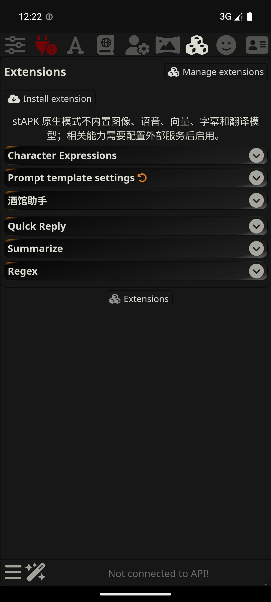

# stAPK Mobile

> 将 SillyTavern 转换为无 Node.js 运行时的 Android 原生应用。

[下载 v0.3.2](https://github.com/zaixiakongyiji/stapk-termux/releases/tag/v0.3.2) · [查看更新日志](CHANGELOG.md) · [查看设计文档](docs/superpowers/specs/2026-07-09-stapk-no-node-native-adapter-design.md)

stAPK Mobile 把 [SillyTavern](https://github.com/SillyTavern/SillyTavern) 官方 Web UI 转换成一个可直接安装的 Android APK。APK 运行时不内置 Node.js、npm、`node_modules` 或 `server.js`；Android 侧通过 WebView 加载转换后的静态资源，并由 Kotlin 原生 HTTP 兼容后端提供单用户核心接口。

> `v0.3.2` 是当前 no-node 正式版，按全新安装交付。0.2.x 数据不会自动迁移，请在替换旧版本前先导出需要保留的数据。

旧的 0.2.x Node runtime 方案仅保留在 Git 历史中。当前开发以 [no-node 原生适配设计](docs/superpowers/specs/2026-07-09-stapk-no-node-native-adapter-design.md) 和 [单用户功能完成计划](docs/plan/2026-07-12-stapk-single-user-feature-completion-plan.md) 为准。

## 目标能力

- **官方 Web UI** — 保留 SillyTavern 的前端界面，避免重新实现聊天产品。
- **无运行时 Node.js** — APK 不携带 Node.js、npm、`node_modules`、runtime zip 或 payload tar 解压流程。
- **原生本地后端** — Android 内部 HTTP server 提供静态资源、角色卡、聊天记录、设置和 OpenAI-compatible MVP 接口。
- **应用私有数据** — 用户数据落在 app-private 目录；0.2.x 旧数据迁移是主体完成后的可选独立项目。
- **可重复转换** — 构建期脚本从 upstream SillyTavern ref 生成 no-node Web 资产、API 契约和 manifest。

## 截图

以下画面直接采集自 Pixel 8 / Android 15 模拟器中的 stAPK WebView，没有使用旧版控制面板或外部浏览器。

<table>
  <tr>
    <td width="33%"></td>
    <td width="33%"></td>
    <td width="33%"></td>
  </tr>
  <tr>
    <td align="center">SillyTavern 官方单用户界面</td>
    <td align="center">25 条中文 World Info 与正文</td>
    <td align="center">扩展管理、Summarize 与 Regex</td>
  </tr>
</table>

## 当前支持范围

### 已支持

| 类别 | 当前能力 |
|------|----------|
| AI 接口 | OpenAI-compatible 模型列表、聊天补全和流式/非流式生成 |
| 单用户数据 | Persona、角色卡、聊天、群组、群聊、recent chats、settings、themes、presets 和 snapshots |
| 角色与知识库 | PNG/JSON 角色卡导入导出、角色卡内嵌 World Info 自动导入、独立 World Info 的导入导出与增删改查 |
| 对话工具 | OpenAI Tokenizer、Quick Reply、Regex，以及只调用 Main API 的 Summarize |
| Vector Storage / RAG | OpenAI 或 Custom OpenAI-compatible 远程 Embedding、本地 SQLite 精确检索，以及 Data Bank、聊天记忆和 World Info 向量激活；默认关闭 |
| 媒体 | 背景、头像、附件、图片与本地媒体管理 |
| 第三方扩展 | client-only 扩展的 GitHub URL 安装、发现、启用、禁用、版本检查、更新、删除和重新安装 |
| 文件与诊断 | 角色、聊天、World Info、预设和媒体等功能页面的 SAF 导入导出；诊断 ZIP 导出与敏感字段脱敏 |

### 有限支持

| 能力 | 限制 |
|------|------|
| 第三方扩展 | 仅在扩展依赖的 SillyTavern API 已由 Native adapter 提供时可用；不承诺任意扩展兼容 |
| 远程多媒体与模型服务 | 不内置 embedding、图片、TTS、STT、字幕或翻译模型；Embedding 已支持 OpenAI 和 Custom OpenAI-compatible，其他远程能力仍只保留外部服务边界 |
| Android 版本 | 正式维护、回归和问题修复范围为 Android 15（API 35）及以上；API 35 已完成设备验收，低于 API 35 的系统不纳入支持矩阵 |

Vector Storage 各类 RAG 开关默认关闭。启用后，待向量化的聊天、Data Bank 或 World Info 文本片段会发送给用户配置的 Embedding Provider，可能产生 API 费用；向量保存在应用私有 SQLite 中，是可由原始数据重建的派生索引。

### 暂不支持

| 类别 | 不支持内容 |
|------|------------|
| 服务端运行时 | Node.js、npm、Python、Shell server extension，以及需要服务端插件进程的第三方扩展 |
| 本地模型 | 本地 LLM、向量模型及其他重型本地模型 |
| 部署模式 | multiuser、远程访问和非 OpenAI-compatible provider |
| 数据维护 | 0.2.x 自动数据迁移、完整应用备份恢复和 Data Maid；这些能力不等同于已支持的单项数据导入导出 |

详细设备证据见 [单用户功能验证记录](docs/plan/2026-07-12-stapk-single-user-feature-validation-record.md)、[Vector Storage 验证记录](docs/plan/2026-07-30-stapk-vector-storage-validation-record.md) 和 [扩展与导入兼容设计](docs/superpowers/specs/2026-07-17-stapk-extension-and-import-compatibility-design.md)。

## 目标工作原理

```text
┌──────────────────────────────────────┐
│           stAPK Mobile               │
│  ┌────────────────────────────────┐  │
│  │   Android UI (Kotlin)           │  │
│  │   MainActivity / WebView        │  │
│  │   SillyTavern official Web UI   │  │
│  └──────────────┬─────────────────┘  │
│                 │ 127.0.0.1:<port>   │
│  ┌──────────────▼─────────────────┐  │
│  │   NativeHttpService / Server   │  │
│  │   Static Web assets            │  │
│  │   Character / Chat / Settings  │  │
│  │   OpenAI-compatible adapter    │  │
│  └────────────────────────────────┘  │
└──────────────────────────────────────┘
```

1. 构建期脚本拉取指定 SillyTavern upstream ref，只提取和补丁化浏览器端 Web 资产。
2. APK 启动后，原生本地 HTTP server 随应用生命周期启动，随机选择 loopback 端口。
3. WebView 加载官方 Web UI；前端请求由原生兼容后端处理，MVP 阶段只开放 OpenAI-compatible 聊天能力。

## 下载

前往 [Releases](https://github.com/zaixiakongyiji/stapk-termux/releases) 页面下载 APK。当前正式版为 [v0.3.2](https://github.com/zaixiakongyiji/stapk-termux/releases/tag/v0.3.2)。

| 要求 | 说明 |
|------|------|
| Android 版本 | 技术安装下限仍为 Android 7.0（API 24+）；正式支持范围为 Android 15（API 35）及以上 |
| APK 类型 | 通用 APK；不包含 native runtime，不按 CPU ABI 拆包 |
| 安装方式 | 0.3.2 建议全新安装，暂不自动迁移 0.2.x 数据 |
| 存储空间 | APK 约 25 MB，另需保存角色、聊天、扩展和媒体数据的空间 |

## 构建

构建期需要 Node.js 20+、JDK 17 和 Android SDK；APK 运行时不包含 Node.js。

```bash
# 1. 克隆代码
git clone https://github.com/zaixiakongyiji/stapk-termux.git

# 2. 安装构建期依赖
npm ci

# 3. 从 SillyTavern release 一键转换、严格验证并构建 APK
npm run build:no-node-apk -- --variant debug --ref release

# 4. APK 位于
# output/stapk-mobile-debug.apk
```

命令同时生成 APK SHA-256、API contract、capability runtime、Web manifest 和 transform report。Release 构建使用 `--variant release`，并要求配置 Gradle signing 环境变量。

转换与发布边界见 [GitHub 自动构建与发版](docs/reference/github-release-automation.md) 和 [no-node 原生适配设计](docs/superpowers/specs/2026-07-09-stapk-no-node-native-adapter-design.md)。

## 自动发版

仓库根目录已经提供 GitHub Actions 工作流：

- `CI`：提交到 `master` 或提交 PR 时执行完整 no-node 严格门禁和 Debug 构建
- `Release`：推送 `v*` tag 时执行同一门禁，构建 release APK 并上传六类发布证据

Release 可通过仓库变量 `SILLYTAVERN_REF` 固定上游 tag/commit；未设置时使用 `release`，resolved commit 会写入 manifest。

标准发版方式：

```bash
git push origin master
git tag -a v0.3.2 -m "release: 发布 stAPK 0.3.2"
git push origin v0.3.2
```

详细说明见 [GitHub 自动构建与发版](docs/reference/github-release-automation.md)。

## 目录结构

```
stapk-termux/
├── mobile/                 # 原生 Android 客户端源码
│   └── app/src/main/
│       ├── assets/         # no-node Web 资产、contract 和 manifest
│       ├── java/           # Kotlin 原生兼容后端与 Android 生命周期
│       └── res/            # UI 布局
├── .github/workflows/      # CI/CD 自动化构建脚本
└── docs/                   # 设计文档与规范
```

## 许可证

本应用为 [SillyTavern](https://github.com/SillyTavern/SillyTavern) 的非官方 Android 转换产物。内置或转换生成的 SillyTavern Web 资产遵循其原始许可证 ([AGPL-3.0](https://www.gnu.org/licenses/agpl-3.0.html))。外壳和原生兼容后端相关自定义代码保留在本仓库。

## 致谢

- [SillyTavern](https://sillytavern.app) — AI 角色扮演前端
- [Node.js](https://nodejs.org/) — 构建期工具链

---

**stAPK Mobile** — 让 SillyTavern 在手机上开箱即用。
