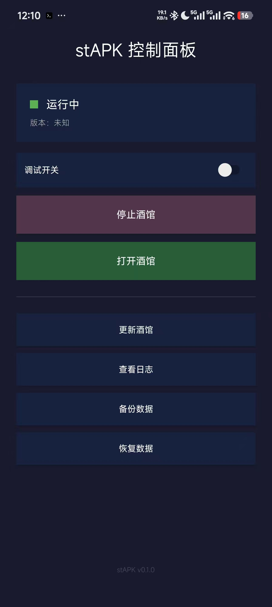

# stAPK Termux

> 一键安装 SillyTavern，无需命令行 —— 在手机上运行你的 AI 角色扮演服务端。

stAPK Termux 是一个定制版 Termux APK，将 [SillyTavern](https://github.com/SillyTavern/SillyTavern)（AI 角色扮演前端）和完整运行环境（Node.js、Git、npm）打包进一个 APK。安装后直接看到图形化控制面板，无需碰命令行。

## 功能

- **一键启动** — 点击按钮启动 SillyTavern，无需手动进入终端
- **图形化控制面板** — 启动、停止、打开 Web UI、查看日志，全是按钮操作
- **托管后台运行** — SillyTavern 由 Termux 前台服务托管，不依赖脱管 `nohup` 进程
- **离线可用** — 首次启动无需联网，Node.js 和 SillyTavern 已内置
- **Git 在线更新** — 一键 `git pull` 更新 SillyTavern 到最新版
- **备份恢复** — 一键备份/恢复用户数据（角色卡、对话、扩展、配置）
- **状态监控** — 实时显示运行状态、端口、版本信息
- **终端入口保留** — 高级用户可解锁原生 Termux 终端（连点版本号 7 次）

## 截图



## 工作原理

```
┌──────────────────────────────────────┐
│           stAPK APK                   │
│  ┌────────────────────────────────┐  │
│  │   Android UI (Java)             │  │
│  │   StapkControlActivity          │  │
│  │   ┌──────┐ ┌──────┐ ┌──────┐  │  │
│  │   │ 启动  │ │ 停止  │ │ 更新  │  │  │
│  │   └──────┘ └──────┘ └──────┘  │  │
│  └──────────────┬─────────────────┘  │
│                 │ 调用 stapk-* 脚本    │
│  ┌──────────────▼─────────────────┐  │
│  │   Termux 运行环境 (aarch64)     │  │
│  │   bash / node / npm / git      │  │
│  │   ┌────────────────────────┐   │  │
│  │   │  SillyTavern            │   │  │
│  │   │  bash start.sh          │   │  │
│  │   │  → node server.js       │   │  │
│  │   │  → localhost:8000       │   │  │
│  │   └────────────────────────┘   │  │
│  └────────────────────────────────┘  │
└──────────────────────────────────────┘
```

1. 用户点击控制面板按钮
2. Java 层通过 `TermuxService` 启动托管运行时脚本（`stapk-runtime`）
3. `stapk-runtime` 在 Termux 环境中执行 `bash start.sh`
4. `TermuxService` 持续托管任务生命周期，UI 定时轮询状态并更新显示

## 下载

前往 [Releases](../../releases) 页面下载最新 APK。

| 要求 | 说明 |
|------|------|
| Android 版本 | 7.0+ |
| 架构 | arm64-v8a (aarch64) |
| 存储空间 | ~1.5GB（含运行环境 + SillyTavern） |

## 构建

### 前置条件

| 工具 | 版本 | 用途 |
|------|------|------|
| Java | 17+ | Gradle 构建 |
| Android SDK | — | APK 编译 |
| Android NDK | — | Native 代码编译 |
| Git | 2.54+ | 源码管理 |
| Node.js | 18+ | Payload 构建 |
| WSL2 (Ubuntu) | — | Bootstrap 构建（仅 Linux） |

### 构建步骤

```bash
# 1. 准备 SillyTavern Payload（Windows/WSL2）
./scripts/prepare-sillytavern-payload.sh

# 2. 构建 Termux Bootstrap（仅 WSL2，可选，已有预构建版本）
./scripts/build-bootstrap-aarch64.sh

# 3. 构建 APK
cd upstream/termux-app
./gradlew assembleDebug

# 4. APK 位于
# upstream/termux-app/app/build/outputs/apk/debug/
```

> 详细构建指南见 [AGENTS.md](AGENTS.md)

## 目录结构

```
stapk-termux/
├── upstream/termux-app/    # Termux App 源码（基于 v0.118.3）
│   └── app/src/main/
│       ├── assets/stapk/   # stAPK 控制脚本
│       ├── java/.../stapk/ # Java 控制面板
│       └── res/layout/     # UI 布局
├── scripts/                # 构建脚本
├── payload/                # SillyTavern 预构建产物（需自行构建）
└── docs/                   # 设计文档
```

## 许可证

本项目各部分采用不同许可证：

| 组件 | 许可证 | 源码 |
|------|--------|------|
| Termux App（基础工程） | [GPLv3](https://www.gnu.org/licenses/gpl-3.0.html) | [termux/termux-app](https://github.com/termux/termux-app) |
| SillyTavern（内置应用） | [AGPL-3.0](https://www.gnu.org/licenses/agpl-3.0.html) | [SillyTavern/SillyTavern](https://github.com/SillyTavern/SillyTavern) |
| stAPK 自定义代码 | [AGPL-3.0](https://www.gnu.org/licenses/agpl-3.0.html) | 本仓库 |

整体分发以 **AGPL-3.0** 为主协议。各组件保留其原始许可证。

## 致谢

- [Termux](https://termux.com) — Android 终端模拟器和 Linux 环境
- [SillyTavern](https://sillytavern.app) — AI 角色扮演前端
- 本项目基于 [termux/termux-app](https://github.com/termux/termux-app) v0.118.3 构建

---

**stAPK Termux** — 让 SillyTavern 在手机上开箱即用。
